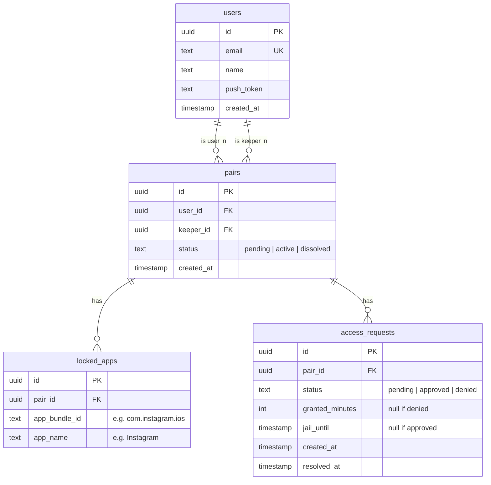

# HoldMyPhone — Entity Relationship Diagram

## Design Principles

- **Fewer tables = less cost.** Every table is a query surface, an index to maintain, and a migration to manage.
- **Derive, don't store.** Daily passwords are computed from `pair_id + date + secret` — no table needed.
- **One row per event, not per state.** Access requests track the full lifecycle in a single row.

## ERD

## Entity Notes

### users
One row per human. Auth is handled externally (Sign in with Apple / Google) — we store the minimum. `push_token` is for APNs/FCM delivery.

### pairs
The core relationship. `user_id` is the person whose apps get locked. `keeper_id` is the Time Keeper. For mutual mode (P1), create two pair rows with the roles flipped.

### locked_apps
Which apps are locked for a given pair. `app_bundle_id` is what the OS needs to enforce blocking. User-customizable — rows are added/removed as the user edits their list.

### access_requests
One row per request. Status goes `pending → approved` or `pending → denied`. If denied, `jail_until` marks when they can request again. If approved, `granted_minutes` says how long. The app checks `created_at + granted_minutes` to know when time expires — no separate timer table.

### daily password (no table)
Computed deterministically: `HMAC(secret, pair_id + date)` → mapped to a word + number combo like "VIBE42". Same input = same output. No storage, no cleanup, no cron job. Rotates naturally at midnight because the date input changes.

## What's deliberately not here

| Thing | Why it's out |
|---|---|
| Sessions / refresh tokens | Use stateless JWTs. Auth provider handles the heavy lifting. |
| Stats / analytics tables | P1. When needed, derive from `access_requests` (count, sum, streak calc). Don't pre-aggregate until scale demands it. |
| Achievements / badges | P2. Add when the feature ships. |
| Notifications log | Push is fire-and-forget. If delivery tracking is needed later, add a table then. |
| App catalog / master list | No need. `locked_apps` stores whatever the user picks from their device. |
